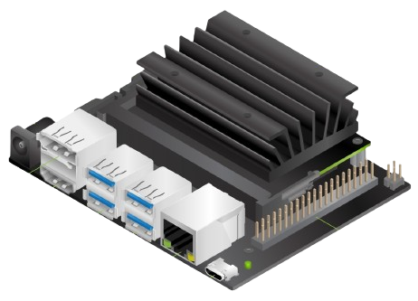
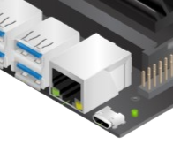

# **Setup Utama**

## **Jetson Nano**

<figure markdown="span">
    { width="500" }
</figure>

Robot Hexapod Barelang F1 menggunakan Mini PC [Jetson Nano](https://developer.nvidia.com/embedded/learn/get-started-jetson-nano-devkit) sebagai central processing unit yang akan memproses bermacam banyaknya data secara real-time. Jetson Nano juga akan berperan penting dalam peran Computer Vision dan Motion Controll dimana semua sensor dan sistem pergerakan robot akan bergantung kepada kecepatan prosesi Jetson Nano yang kencang. <br>

### **Instalasi NVidia Jetson**
Untuk melakukan instalasi software Jeson Nano dapat dilihat pada Official NVidia Jetson Nano Installation Guide dibawah ini: <br>
[Visit the official page](https://developer.nvidia.com/embedded/learn/get-started-jetson-nano-devkit#write){ .md-button } <br>


Setelah melakukan proses instalasi dari link idatas, masukkan command berikut ini untuk melakukan update system
``` css
sudo apt update
```
dan 
``` css
sudo apt upgrade
```

Dua command diatas tadi berfungsi untuk memperbarui local package index dan memastikan sistem memiliki informasi terbaru tentang semua package yang ada dan versinya.


### **Jetson Nano Ubuntu Dummy Video**
Penginstalan Dummy video Driver ini diperlukan agar Jetson dapat menampilkan gambar pada device yang akan digunakan.
Untuk monitor dengan resolusi layar tetap menggunakan [VNC](https://www.realvnc.com/en/connect/download/viewer/) atau [Nomachine](https://kb.nomachine.com/AR02R01074), run perintah berikut ini di terminal satu per satu.
``` css
sudo apt-get install xserver-xorg-core
```
``` css
sudo apt-get install xserver-xorg-video-dummy
```
``` css
sudo apt-get install --reinstall xserver-xorg-input-all
```
``` css
sudo nano /usr/share/X11/xorg.conf.d/xorg.conf
``` 
dan lakukan penginstalan dengan memasukkan perintah ini:
``` css
sudo apt install nano
```

<br> Setelah itu, paste perintah berikut ini:

``` css
Section "Module"
        
    Disable     "dri"
        SubSection  "extmod"
            Option  "omit xfree86-dga"
        EndSubSection
    EndSection

    Section "Device"
        Identifier  "Tegra0"
        Driver      "nvidia"
        Option      "AllowEmptyInitialConfiguration" "true"
    EndSection

    Section "Monitor"
       Identifier "DSI-0"
       Option    "Ignore"
    EndSection

    Section "Screen"
       Identifier    "Default Screen"
       Monitor        "Configured Monitor"
       Device        "Default Device"
       SubSection "Display"
           Depth    24
           Virtual 1280 720
       EndSubSection
    EndSection
```
Setelah memasukkan semua perintah diatas, langkah berikutnya adalah keluar dari program dan menyimpannya dengan cara `ctrl + X` dan memilih opsi Yes `Y` kitka muncul permintaan untuk menyimpan program.

<br>

## **VSC Jetson**
Untuk melakukan instalasi [Visual Studio Code](https://code.visualstudio.com) ke dalam Jetson Nano dapat dilakukan dengan mendownload VSC tertentu melalui tombol dibawah ini: <br>

[Direct Download VSC for Jetson :fontawesome-solid-download:](https://update.code.visualstudio.com/1.77.3/linux-deb-arm64/stable){ .md-button } <br>

Setelah itu memasukkan perintah ini untuk melakukan penginstalan: <br>
``` css
cd Downloads 
```
``` css
sudo dpkg -i [nama file VS code yang didownload]
```

<br>

## **NoMachine**
[Nomachine](https://kb.nomachine.com/AR02R01074) adalah program desktop jarak jauh yang bisa digunakan dengan NVidia Jetson untuk banyak macam hal, diantaranya: <br>

- Mengakses file, audio dan video.
- Merekam dan menyiarkan layar.
- Memindahkan dan mentransfer file.

Nomachine menjadi pilihan utama karena lebih ringan dan lebih cepat ketimbang VNC. Penginstalan NoMachine kedalam NVidia Jetson Nano dapat dilakukan dengan mendownload NoMachine .deb package untuk ARmv8 melalui [Official Website]() atau mendownloadnya langsung menggunakan command wget sebagai berikut: <br>
``` css
cd Downloads 
```
``` css
wget https://www.nomachine.com/free/arm/v8/deb -O nomachine.deb
```
Lalu melakukan penginstalan dengan command ini:
``` css
sudo dpkg -i nomachine.deb
```


<br> Setelah melakukan semua step diatas, masukkan program berikut untuk reboot system:
``` css
sudo reboot
```

<br>

### **Setting IP Statis untuk LAN Nomachine**
IP statis sangat berguna jika suatu webiste atau device external perlu mengingat IP penggunanya, IP statis adalah titik akses tetap sehingga IP yang diakses tidak akan berubah-ubah. Hal ini dapat membuat komunikasi antar device semakin mudah dan konsisten.<br> 
Seperti pada namanya, disini kita akan menggunakan LAN/kabel Ethernet.

<figure markdown="span">
    { width="500" }
</figure>

JetsonNano memiliki sebuah slot untuk kabel LAN/Ethernet, port ini dapat digunakan untuk menghubungkan JetsonNano dengan PC anda menggunakan kabel LAN/Ethernet.

### **Konfigurasi IP Statis**
Tanpa Internet, anda perlu mengatur IP statis pada kedua perangkat yatu pada JetsonNano dan pada PC anda 

#### Pada Jetson Nano
- Edit file konfigurasi jaringan:
```css
sudo nano /etc/network/interfaces
```

- Lalu tambahkan konfigurasi berikut:
```css
auto eth0
iface eth0 inet static
address 192.168.1.2
netmask 255.255.255.0
```

- Simpan dan restart jaringan dengan memasukkan perintah ini:
```css
sudo systemctl restart networking
```

#### Pada PC User
- Atur IP Statis di pengaturan jaringan:
!!! info "Windows"
    * Buka Control Panel > **Network and Sharing Center** > **Change adapter settings**
    * Klik kanan pada koneksi Ethernet > **Properties**
    * Pilih **Internet Protocol Version 4 (TCP/IPv4)** dan klik "Properties"
    * Masukkan: 
        <br> - IP Adress: `192.168.1.1`
        <br> - Subnet Mask: `255.255.255.0`
    * Klik OK
    

!!! warning "Ubuntu" 
    OOPS we haven't gotten that far yet, we'll make an update as soon as we do! 

<br>

#### **Verifikasi Koneksi**
Untuk mengverifikasi jika kedua perangkat (Jetson Nano dengan PC pengguna)sudah tersambung dengan benar, kita dapat membuat kedua device saling ping untuk memastikan keduanya tersambung.

- Dari PC ke Jetson Nano:
```css
ping 192.168.1.2
```

- Dari Jetson Nano ke PC:
```css
ping 192.168.1.1
```

### **Menggunakan NoMachine**
Agar dapat menggunakan NoMachine, kita harus menjalankan NoMachine server pada Jetson Nano terlebih dahulu (biasanya server berjalan otomatis setelah instalasi). <br>

Lalu pada PC ada beberapa langkah yang harus dilakukan:

- Buka NoMachine client dan tambahkan koneksi baru: <br>
    \- Pilih **manual connection**.
    \- Masukkan alamat IP Jetson Nano (`192.168.1.2`).
    \- Pilih protokol (Default adalah NX).

- Klik Connect.
- Masukkan username dan password Jetson Nano untuk login.

<br>

### **Instalasi ROS Bridge**
[ROS Bridge](https://wiki.ros.org/rosbridge_suite) adalah suatu framework atau Tool yang memungkinkan komunikasi antara Robot Operating System dengan sistem external seperti penggunaan website, aplikasi mobile, atau bahasa pemrograman lainnya sembari menyediakan interface untuk semua sistem non-ROS agar sistem-sistem tersebut dapat bekerja dengan ROS dengan cara bertukar pesan dan protokol seperti [WebSocket](https://developer.mozilla.org/en-US/docs/Web/API/WebSockets_API), [JSON](https://www.json.org/json-en.html), atau API Lainnya.

- Install ROS Bridge di Jetson Nano
Jalankan perintah berikut di Jetson Nano:
```css
sudo apt-get install ros-melodic-rosbridge-server
```
!!! note
    Ganti *melodic* dengan versi ROS Anda jika berbeda

- Jalankan ROS Bridge
```css
roslaunch rosbridge_server rosbridge_websocket.launch
```

Secara default, server WebSocket berjalan di **port 9090**.

- Test ROS Bridge
Gunakan WebSocket client seperti **ROS Web Tools** atau **RQT** untuk memeriksa data

<br>

### **Ubah Nama Host Jetson**
Menggunakan nama Host atau mDNS (Bonjour/Avahi) <br>
Jika Anda sering berpindah jaringan dan tidak ingin repot mengatur IP statis, anda dapat gunakan **nama host** atau teknologi **mDNS** untuk menggantikan IP Address. Langkah-langkahnya adalah sebagai berikut:

**Instalasi mDNS (Avahi) di Jetson:**

- Pastikan Avahi terinstall di Jetson Nano dengan menjalankan perintah berikut ini:
```css
sudo apt update
sudo apt install avahi-daemon libnss-mdns
```

- o	Setelah terinstal, Jetson akan dapat diakses menggunakan hostname.local. Misalnya, jika nama host Jetson Anda adalah bf1, maka Anda dapat mengaksesnya dengan:
```css
ws://bf1.local:9090
```

<br>
