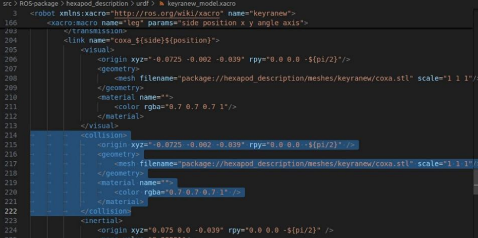

# **Simulation Setup**


## **ROS Gazebo**
[ROS Gazebo](https://gazebosim.org/home) adalah tool open-source 2D/3D simulator robot yang memungkinkan kita untuk mengembangkan, memeriksa dan memvalidasi sistem robotik di lingkungan virtual sebelum mewujudkannya di dunia nyata. Disini kami akan menunjukkan langkah-langkah instalasi Ros Gazebo untuk simulasi robot. Operating System yang kami gunakan adalah [Ubuntu 18](https://releases.ubuntu.com/18.04/).

**Install Visual Studio Code** <br>
Langkah pertama adalah melakukan penginstalan Visual Studio Code jika kamu belum melakukannya, ini menjadi alat yang akan membantumu dalam proses pemrograman nanti. Kamu dapat melihat panduan penginstalan Visual Studio Code pada OS Ubuntu 18 dengan menekan tombol dibawah ini <br>

[Penginstalan VSC di Ubuntu 18](https://www.ubuntu18.com/install-visual-studio-code-ubuntu-18/){ .md-button } 

<br> **Install ROS melodic** <br>
Setelah itu kita akan masuk ke tahap selanjutnya yaitu penginstalan ROS Melodic. ROS Melodic adalah versi ROS yang dirilis pada tahun 2018 yang terutama dimaksudkan untuk operating system ubuntu 18. Untuk Petunjuk penginstalannya dapat dilihat melalui tombol dibawah ini. <br>

[Penginstalan ROS Melodic](http://wiki.ros.org/melodic/Installation/Ubuntu){ .md-button }

<br> **Penginstalan IceCream CPP** <br>
Icecream CPP adalah tool debugging yang akan mempermudah proses print dan inspeksi variable ketika runtime. Sebelum memulai instalasi IceCream CPP, kita harus terlebih dahulu menginstall cmake versi 3.16 ke atas agar IceCream CPP dapat digunakan. <br>
Untuk menginstall cmake versi terbaru dapat dilakukan melalui tombol di bawah ini. <br>

[CMake Versi Terbaru](https://github.com/Kitware/CMake/releases/){ .md-button } <br>

Jika sudah, maka kita dapat lanjut ke tahap penginstalan IceCream CPP melalui tombol ini yang akan membawamu ke dalam github penginstalan IneCream CPP. File didalam github ini dapat didownload dalam bentuk zip dan sebagainya, lalu ikuti Langkah instalasi di bawahnya.<br>

[IceCream CPP](https://github.com/renatoGarcia/icecream-cpp?tab=readme-ov-file#install){ .md-button }

### **Dependencies yang diperlukan**
Langkah terakhir adalah menginstall ROS Dependencies yang diperlukan, dibawah adalah seluruh command yang diperlikan untuk menginstall dependencies agar ROS Gazebo dapat digunakan.

!!! note
    Sesuaikan dengan jennis ros yang digunakan, disini kami menyarankan menggunakan ROS Melodic.

```css
sudo apt install git
sudo apt install ros-noetic-sound-play
sudo apt install ros-noetic-openni2-launch
sudo apt install ros-noetic-joy
sudo apt install ros-noetic-rtabmap
sudo apt install ros-noetic-rtabmap-ros
sudo apt install ros-noetic-navigation
sudo apt install ros-noetic-move-base
sudo apt install ros-noetic-robot-state-publisher
sudo apt install ros-noetic-robot-localization
sudo apt install ros-noetic-navfn
sudo apt install ros-noetic-amcl
sudo apt install ros-noetic-diagnostic-updater
sudo apt install ros-noetic-xacro
sudo apt install ros-noetic-depthimage-to-laserscan
sudo apt install ros-noetic-imu-filter-madgwick
sudo apt install ros-noetic-ros-controllers
sudo apt install ros-noetic-ros-control
sudo apt install ros-noetic-spacenav-node
```

!!! abstract "Optional"
    Setelah memasukkan perintah di atas, dibawah ini adalah perintah opsional yang dapat digunakan jika menggunakan Flashdrive/USB
    ```css
    sudo apt install libusb-1.0-0-dev
    sudo apt install libsdl-dev
    ```

```css
sudo apt install ros-noetic-gazebo-ros-pkgs
sudo apt install ros-noetic-gazebo-ros-control
```

Jika seluruh Langkah sudah dilakukan, maka ROS Gazebo sudah dapat digunakan untuk proyek robotmu!

## **Solidworks to Gazebo**
Jika kamu ingin tahu cara melakukan exporting file desain 3D robotmu dari program desain [SolidWorks](https://www.solidworks.com) agar dapat digunakan kedalam ROS Gazebo, kami sudah menyusun semua langkah yang diperlukan dibawah ini: <br>
<br>

### **SolidWorks to ROS Gazebo**

Agar dapat menggunakan desain robot yang sudah kita persiapkan dari aplikasi [SolidWorks](https://www.solidworks.com) ke dalam [ROS Gazebo](https://gazebosim.org/home) maka kita harus mengubah tipe file desain 3D robot menjadi file **.URDF** terlebih dahulu. Akan tetapi, opsi mengeksport file ke tipe URDF tidak akan ada di Solidowrks sebelum kita menginstall plugin di bawah ini. <br>

[SolidWorks to URDF Exporter](https://wiki.ros.org/sw_urdf_exporter){.md-button} <br>

<br>
Setelah menginstall extensi exporter URDF pada SolidWorks, kamu dapat mengakses video-video yang akan menjelaskan basic desain .urdf pada Gazebo melalui tombol dibawah ini. <br>

[Playlist Video Basics](https://www.youtube.com/playlist?list=PLeEzO_sX5H6TBD6EMGgV-qdhzxPY19m12){.md-button} <br>

<br>
Langkah berikutnya adalah mengexport bagian-bagian robot yang digunakan, untuk bagian kaki dapat diupload secara terpisah (kaki bagian tengah kiri, dan kaki bagian tengah kanan).

<br>
File yang telah di export kemudian di **Zip** lalu di copy ke ubuntu 18 yang telah disetup sebelumnya, di ubuntu ini kita aka Unzip file pada bagian `Document`, lalu copy bagian stl **Body**, **Coxa**, **Femur**, dan **Tibia**. Lalu Paste file-file ini pada bagian `src/hexapod_description/meshes`

<br>
Lalu download aplikasi [Meshlab](https://www.meshlab.net) yang akan digunakan untuk mengurangi faces yang akan digunakan sebagai stl collision nantinya.
Untuk ubuntu, petunjuk penginstalan aplikasi meshlab dapat di akses melalui tombol dibawah ini.

[Meshlab for Ubuntu](https://www.howtoinstall.me/ubuntu/18-04/meshlab/){.md-button} <br> 

<br>
Sehingga pada folder `src/hexapod_description/meshes` akan terdapat 8 total file stl yang akan digunakan di Gazebo (body, body_col, coxa, coxa_col, *dan seterusnya*)

<br>

## **Hal-hal Yang Perlu Diperhatikan Dalam Pemakaian**
ROS Gazebo mungkin tidak begitu mudah dipahami terutama jika barusaja memulai menggunakan ROS, apalagi jika desain yang diimpor kedalam gazebo adalah desain robot yang rumit seperti robot Hexapod. Berikut adalah hal-hal yang harus diperhatikan saat menggunakan model robot Hexapod dalam ROS Gazebo.

<br>
<span style="font-size: 1.5em;">**Xacro**</span>

**Hexapod_Model.Xacro (ROS_package > hexapod_description > urdf >hexapod_model.xacro)**

Program ini merupakan salah satu file Xacro yang digunakan dalam ROS khususnya untuk mendefinisikan model robot dalam simulasi gazebo. Berikut merupakan beberapa hal yang harus diperhatikan dalam program ini.

<figure markdown="span">
    { width="900" }
</figure>

Perhatikan program bagian parameter diatas.

•`<xacro:property>` digunakan untuk mendefinisikan parameter yang digunakan
seluruh file. <br>
• coxa_length, femur_length, tibia_length, dan tarsus_length mendefinisikan
panjang bagian-bagian kaki robot.<br>
• pi mendefinisikan untuk rotasi dalam bentuk radian.

Kemudian, temukan kode berikut pada file program `keyranew_model.xacro`,
Tepatnya di bagian `<!-- coxa -->`.

<figure markdown="span">
    { width="900" }
</figure>

Pada bagian visual ini, masukkan nilai jarak coxa, femur, dan tibia sesuai dengan
jarak yang telah dibuat pada desain robot. Pada nilai visual di atas, menggunakan
satuan Meter. Sehingga apabila satuan yang digunakan pada desain adalah
milimeter, untuk di visual ubah nilai tersebut menggunakan satuan Meter

<br>
Kemudian, perhatikan pada bagian collision.
<figure markdown="span">
    { width="900" }
</figure>

Ubah nilai yang terdapat pada collision agar sama dengan nilai yang terdapat pada visual.
Lakukan hal yang sama pada bagian `<!-- femur -->`, dan `<!-- tibia -->`.


<br>
Setelah itu, temukan code berikut
<figure markdown="span">
    { width="900" }
</figure>

Kode ini memanggil macro bernama <xacro:leg> untuk membuat kaki robot
secara otomatis tanpa harus menulis URDF yang panjang. Side R mendefinisikan kaki
sebelah kanan, side L mendefinisikan kaki sebelah kiri, M (Middle) mendefinisikan
kaki tengah, serta F (Front) mendefinisikan kaki depan.
Kemudian, sesuaikan nilainya dengan code di atas. Angle merupakan sudut yang di
atur agar kaki membentuk pola simestris, agar memastikan keseimbangan saat
berjalan.

<br>

**Tangga (ROS_package > lapangan_2023 > tangga.urdf)**

Program ini untuk mendefinisikan sebuah bidang miring dengan beberapa bagian utama
yaitu bidang dasar, segmen bertingkat, dinding samping, dan ujung akhir. Berikut merupakan
beberapa hal yang perlu diperhatikan pada program ini.
<figure markdown="span">
    { width="900" }
</figure>

Code di atas yaitu untuk mendefinisikan base_link yang merupakan bidang dasar. Pada
code di atas base_link didefinisikan dengan panjang 3 meter, lebar 0.45 meter, serta
ketebalan 0.02 meter (Bagian Visual). 

<br>
Jika ingin mengubah ukuran pada base_link, dapat di
ubah pada nilai `<box size =>` dibawah. Jangan lupa untuk menyamakan nilai pada visual
dengan collision.
<figure markdown="span">
    { width="900" }
</figure>

<br>
Untuk macro membuat tangga, temukan code berikut.
<figure markdown="span">
    { width="900" }
</figure>

Makro ini memiliki dua parameter yaitu `name` (nama link yang dibuat) dan `counter` (indeks
untuk menentukan posisi dan ukuran link).

<br>
<figure markdown="span">
    { width="900" }
</figure>
Code di atas mendefinisikan bentuk box yang akan di launch pada gazebo. Perhatikan
pada bagian <box size=”0..036 0.045 ${0.02 * counter}”/>. Setiap tingkat akan semakin
tinggi karena ukurannya tergantung pada counter. Samakan nilai pada collision dengan nilai
pada visual.


<br>
<span style="font-size: 1.5em;">**File STL**</span>

Pada bagian meshes robot, bagian collision disesuaikan kembali untuk meminimkan kontak poin.
Edge pada STL dikurangi menjadi dibawah 1000 untuk STL Collision. Untuk menguranginya,
menggunakan aplikasi Meshlab.

Pada beberapa part atau bagian robot terdapat beberapa yang memiliki jumlah kontak poin yang
terlalu banyak yang mempengaruhi dalam proses launch file ataupun pada program file. Terlalu
banyak kontak poin dapat menyebabkan program yang terlalu panjang dan dapat menyebabkan
error berkemungkinan sering terjadi.

Cara menggunakan MeshLab : <br>
**Filter** > **Remeshing**, **Penyederhanaan**, dan **Rekonstruksi** > **Penyederhanaan**: Quadric Edge
Collage Decimation.